# 🚀 MCP Stateful Tool Java Server (Streamable HTTP)

A **Spring AI MCP** server with **Streamable HTTP transport** demonstrating **stateful multi-turn conversations**. This production-ready server provides real-time Server-Sent Events (SSE) streaming and maintains conversation state across multiple tool calls using Spring Boot and the official Spring AI MCP framework.

## ✅ **MIGRATED TO STREAMABLE HTTP: Server now supports the latest MCP Streamable HTTP protocol**

### 🌐 **Key Endpoint: `http://localhost:8080/mcp`**

## 🎯 What This Demonstrates

- **Multi-turn Conversations**: Tools that collect parameters across multiple interactions  
- **Session State Management**: Persistent conversation state with unique session IDs
- **Progressive Parameter Collection**: Ask for missing parameters step-by-step
- **Spring AI MCP Integration**: Official Spring AI MCP-compliant server implementation
- **Streamable HTTP Transport**: Latest MCP transport with HTTP POST/GET and SSE streaming
- **Real-time Notifications**: Server-Sent Events for tool, resource, and prompt changes
- **MCP Inspector Ready**: Full compatibility with MCP Inspector's streamable HTTP client

## 🏗️ Architecture Overview


## 🛠️ MCP Protocol Flow


## 🔧 Available Stateful Tools

### 1. `calculate` - Mathematical Calculator
Progressive mathematical computation with multiple output formats.


**Features**:
- Mathematical expressions (`+, -, *, /, sqrt, pi, e`)
- Output formats: `decimal`, `fraction`, `scientific`, `integer`
- Session-based parameter collection
- Error handling with retry support

### 2. `create_file` - Multi-turn File Creator
Progressive file creation across multiple interactions.


### 3. `build_profile` - Progressive Profile Builder
Multi-turn user profile construction with JSON output.

### 4. `list_sessions` - Session Management
Debug and manage active conversation sessions.

## 🚀 Quick Start Guide

### Prerequisites
- **Java 21+** (Required)
- **Maven 3.6+** (Required)
- **MCP Inspector** (Recommended client)

### 1. Start the Server

```bash
# Set correct JAVA_HOME (if needed)
export JAVA_HOME=/Users/$(whoami)/Library/Java/JavaVirtualMachines/openjdk-21.0.2/Contents/Home

# Clean, compile and run
mvn clean compile
mvn spring-boot:run
```

**Expected Output:**
```
🤖 Starting MCP Stateful Tool Java Server...
✅ Spring AI MCP Server is ready for connections
🔗 MCP Streamable HTTP Endpoint: http://localhost:8080/mcp
🔗 Server-Sent Events: http://localhost:8080/sse
📋 Spring AI MCP Protocol Features:
  - Version: 2024-11-05
  - Transport: Streamable HTTP (HTTP POST/GET + SSE)  
  - Tools: calculate, create_file, build_profile, list_sessions
  - Stateful conversations: Enabled
```

### 2. Connect with MCP Inspector

**Recommended Method:**

1. **Open MCP Inspector**
2. **Select Connection Type**: `Streamable HTTP`
3. **Enter Server URL**: `http://localhost:8080/mcp`
4. **Connect** - The server will automatically handle session management

```mermaid
graph LR
    A[Open MCP Inspector] --> B[Select 'Streamable HTTP']
    B --> C[Enter: http://localhost:8080/mcp]
    C --> D[Click Connect]
    D --> E[✅ Ready to use tools!]
    
    style E fill:#4caf50
```



## 🔌 MCP Client Configuration

### Spring AI MCP Client

Add the Spring AI MCP client dependency:

```xml
<dependency>
    <groupId>org.springframework.ai</groupId>
    <artifactId>spring-ai-mcp-client-streamable-webflux</artifactId>
    <version>1.1.0-SNAPSHOT</version>
</dependency>
```

Configure the client in your `application.yml`:

```yaml
spring:
  ai:
    mcp:
      client:
        transport:
          type: streamable-http
          streamable-http:
            base-url: http://localhost:8080
            mcp-endpoint: /mcp
            sse-endpoint: /sse
            timeout: 30s
            keep-alive-enabled: true
        capabilities:
          tools: true
          resources: true
          prompts: true
          completion: true
```

### Java Client Configuration

```java
@Configuration
public class McpClientConfig {
    
    @Bean
    public McpClient streamableHttpMcpClient() {
        return McpClient.builder()
            .transport(StreamableHttpTransport.builder()
                .baseUrl("http://localhost:8080")
                .mcpEndpoint("/mcp")
                .sseEndpoint("/sse")
                .timeout(Duration.ofSeconds(30))
                .keepAliveEnabled(true)
                .build())
            .capabilities(McpCapabilities.builder()
                .tools(true)
                .resources(true)
                .prompts(true)
                .completion(true)
                .build())
            .build();
    }
}

@Service  
public class McpClientService {
    
    @Autowired
    private McpClient mcpClient;
    
    public List<Tool> discoverTools() {
        return mcpClient.listTools().getTools();
    }
    
    public ToolResponse callTool(String toolName, Map<String, Object> arguments) {
        return mcpClient.callTool(ToolCall.builder()
            .name(toolName)
            .arguments(arguments)
            .build());
    }
}
```

### Claude Desktop Configuration

Add to your Claude Desktop MCP configuration file:

```json
{
  "mcpServers": {
    "mcp-stateful-java": {
      "transport": "streamable-http",
      "endpoint": "http://localhost:8080/mcp",
      "capabilities": ["tools", "resources", "prompts"]
    }
  }
}
```

### Python Client Example

```python
import asyncio
import aiohttp
import json
from typing import Dict, Any

class StreamableHttpMcpClient:
    def __init__(self, base_url: str, mcp_endpoint: str = "/mcp"):
        self.base_url = base_url.rstrip('/')
        self.mcp_endpoint = mcp_endpoint
        self.session = None
    
    async def __aenter__(self):
        self.session = aiohttp.ClientSession()
        return self
    
    async def __aexit__(self, exc_type, exc_val, exc_tb):
        if self.session:
            await self.session.close()
    
    async def call_jsonrpc(self, method: str, params: Dict[str, Any] = None) -> Dict[str, Any]:
        payload = {
            "jsonrpc": "2.0",
            "id": 1,
            "method": method,
            "params": params or {}
        }
        
        async with self.session.post(
            f"{self.base_url}{self.mcp_endpoint}",
            json=payload,
            headers={"Content-Type": "application/json"}
        ) as response:
            return await response.json()
    
    async def list_tools(self):
        return await self.call_jsonrpc("tools/list")
    
    async def call_tool(self, name: str, arguments: Dict[str, Any]):
        return await self.call_jsonrpc("tools/call", {
            "name": name,
            "arguments": arguments
        })

# Usage example
async def main():
    async with StreamableHttpMcpClient("http://localhost:8080") as client:
        # Discover tools
        tools_response = await client.list_tools()
        print("Available tools:", tools_response)
        
        # Call calculator tool
        result = await client.call_tool("calculate", {
            "expression": "sqrt(16) + 2 * 3"
        })
        print("Calculation result:", result)

# Run the client
asyncio.run(main())
```

### 3. Test Multi-turn Conversations

**Example: Calculator Tool**
```bash
# Turn 1: Start calculation  
Tool: calculate, Args: {}
Response: "Missing parameter: expression. Session ID: abc-123"

# Turn 2: Provide expression
Tool: calculate, Args: {"expression": "sqrt(16) + 2 * 3", "sessionId": "abc-123"}  
Response: "Expression: sqrt(16) + 2 * 3\nResult: 10.0"
```

## 🔧 Configuration Details

## 🌐 API Endpoints

### Streamable HTTP MCP Endpoints

| Method | Endpoint | Description | Content-Type |
|--------|----------|-------------|--------------|
| `POST` | `/mcp` | Main MCP protocol endpoint | `application/json` |
| `GET` | `/sse` | Server-Sent Events stream | `text/event-stream` |
| `GET` | `/actuator/health` | Health check | `application/json` |

### JSON-RPC API Examples

#### Initialize Connection
```bash
curl -X POST http://localhost:8080/mcp \
  -H "Content-Type: application/json" \
  -d '{
    "jsonrpc": "2.0",
    "id": 1,
    "method": "initialize",
    "params": {
      "protocolVersion": "2024-11-05",
      "capabilities": {
        "tools": {}
      },
      "clientInfo": {
        "name": "test-client",
        "version": "1.0.0"
      }
    }
  }'
```

#### List Available Tools
```bash
curl -X POST http://localhost:8080/mcp \
  -H "Content-Type: application/json" \
  -d '{
    "jsonrpc": "2.0",
    "id": 2,
    "method": "tools/list",
    "params": {}
  }'
```

#### Call Calculator Tool
```bash
curl -X POST http://localhost:8080/mcp \
  -H "Content-Type: application/json" \
  -d '{
    "jsonrpc": "2.0",
    "id": 3,
    "method": "tools/call",
    "params": {
      "name": "calculate",
      "arguments": {
        "expression": "sqrt(16) + 2 * 3",
        "format": "decimal"
      }
    }
  }'
```

#### Call File Creation Tool (Multi-turn)
```bash
# Step 1: Start file creation (missing parameters)
curl -X POST http://localhost:8080/mcp \
  -H "Content-Type: application/json" \
  -d '{
    "jsonrpc": "2.0",
    "id": 4,
    "method": "tools/call",
    "params": {
      "name": "create_file",
      "arguments": {}
    }
  }'

# Response will include sessionId and request for path parameter

# Step 2: Continue with path parameter
curl -X POST http://localhost:8080/mcp \
  -H "Content-Type: application/json" \
  -d '{
    "jsonrpc": "2.0",
    "id": 5,
    "method": "tools/call",
    "params": {
      "name": "create_file",
      "arguments": {
        "sessionId": "session-uuid-from-step-1",
        "path": "/tmp/test.txt"
      }
    }
  }'
```

### Server-Sent Events

Listen for real-time updates:

```bash
# Listen to SSE stream
curl -H "Accept: text/event-stream" http://localhost:8080/sse

# Expected events:
# event: tool-progress
# data: {"toolName": "calculate", "progress": 0.5, "message": "Processing..."}
# 
# event: tool-completed
# data: {"toolName": "calculate", "result": "Calculation completed"}
```

### Spring AI MCP Configuration

```yaml
# application.yml
spring:
  application:
    name: mcp-stateful-server-java
  ai:
    mcp:
      server:
        protocol: STREAMABLE  # Enable Streamable HTTP transport
        name: mcp-stateful-server-java
        version: 1.0.0
        type: SYNC  # Use SYNC for Streamable HTTP MCP server
        enabled: true
        stdio: false
        instructions: "Streamable HTTP server with stateful tools for multi-turn conversations"
        capabilities:
          tool: true
          resource: true
          prompt: true
          completion: true
        streamable-http:
          mcp-endpoint: /mcp  # Main MCP endpoint
          keep-alive-interval: 30s  # Optional: enable keep-alive for SSE

server:
  port: 8080

# CORS for MCP Inspector
cors:
  allowed-origins: "*"
  allowed-methods: "GET,POST,PUT,DELETE,OPTIONS"
  allowed-headers: "*"
  allow-credentials: true
```

### Key Components


## 🧪 Testing & Verification

### Health Checks
```bash
# Verify SSE endpoint
curl -H "Accept: text/event-stream" "http://localhost:8080/sse" --max-time 5

# Expected: event:endpoint data:/mcp/message?sessionId=<uuid>
```

### Integration Test
```bash
# Run all tests
mvn test

# Specific test
mvn test -Dtest=McpStatefulToolApplicationTests
```

## 🔮 Advanced Features

### Custom Tool Development

```java
@Service
public class CustomStatefulTool {
    
    @Autowired
    private SessionManager sessionManager;
    
    @Tool(description = "Your custom multi-turn tool")
    public String customTool(String param1, String param2, String sessionId) {
        Map<String, String> requiredParams = Map.of(
            "param1", "First parameter description",
            "param2", "Second parameter description"
        );
        
        ToolSession session = getOrCreateSession(sessionId, "custom_tool", requiredParams);
        
        // Collect parameters
        if (param1 != null) session.addParam("param1", param1);
        if (param2 != null) session.addParam("param2", param2);
        
        // Check completion
        if (!session.isComplete()) {
            return requestMissingParameter(session);
        }
        
        // Execute business logic
        String result = performOperation(session.getCollectedParams());
        sessionManager.deleteSession(sessionId);
        return result;
    }
}
```

### Session Persistence

```java
@Component
public class PersistentSessionManager extends SessionManager {
    
    @Autowired
    private SessionRepository repository;
    
    @Override
    public ToolSession createSession(String id, String tool, Map<String, String> params) {
        ToolSession session = super.createSession(id, tool, params);
        repository.save(toEntity(session));
        return session;
    }
}
```

## 🚀 Production Deployment

### Docker Configuration
```dockerfile
FROM openjdk:21-jdk-slim
COPY target/mcp-stateful-tool-java-1.0.0.jar app.jar
EXPOSE 8080
ENTRYPOINT ["java", "-jar", "/app.jar"]
```

### Kubernetes Deployment
```yaml
apiVersion: apps/v1
kind: Deployment
metadata:
  name: mcp-server
spec:
  replicas: 3
  selector:
    matchLabels:
      app: mcp-server
  template:
    metadata:
      labels:
        app: mcp-server
    spec:
      containers:
      - name: mcp-server
        image: mcp-stateful-tool-java:1.0.0
        ports:
        - containerPort: 8080
        env:
        - name: SPRING_PROFILES_ACTIVE
          value: "production"
```

## 🎯 Key Benefits

✅ **Enterprise Ready**: Spring Boot ecosystem integration  
✅ **MCP Inspector Compatible**: Full streamable HTTP support  
✅ **Type Safety**: Compile-time parameter validation  
✅ **Scalable**: WebFlux reactive architecture  
✅ **Stateful**: Multi-turn conversation support  
✅ **Standards Compliant**: MCP 2024-11-05 protocol  
✅ **Production Ready**: Comprehensive error handling  

## 🔧 Troubleshooting

### Connection Issues
```bash
# Check if server is running
curl http://localhost:8080/sse --max-time 2

# Should return: event:endpoint data:/mcp/message?sessionId=...
```

### Java Environment
```bash
# Verify Java 21+
java -version

# Set JAVA_HOME if needed  
export JAVA_HOME=$(/usr/libexec/java_home)
```

### Server Logs
Check logs for successful startup:
```
✅ Spring AI MCP Server is ready for connections
Registered tools: 4
Protocol version: 2024-11-05
Transport: WebFlux (WebSocket, SSE, Streamable HTTP)
```

## 📚 Related Documentation

- [Spring AI MCP Reference](https://docs.spring.io/spring-ai/reference/api/mcp/mcp-overview.html)
- [Model Context Protocol Specification](https://modelcontextprotocol.io/specification)
- [MCP Inspector Documentation](https://github.com/modelcontextprotocol/inspector)

## 📜 License

MIT License - See LICENSE file for details

---

**🔥 Ready for Production: Full MCP Inspector compatibility with Spring AI MCP framework**