# 🤖 MCP Stateful Tool Java Server

A **Spring AI MCP** server demonstrating **stateful multi-turn conversations** with full **MCP Inspector compatibility**. This production-ready server maintains conversation state across multiple tool calls using Spring Boot and the official Spring AI MCP framework.

## ✅ **WORKING STATUS: Server is fully operational with MCP Inspector's streamable HTTP client**

## 🎯 What This Demonstrates

- **Multi-turn Conversations**: Tools that collect parameters across multiple interactions  
- **Session State Management**: Persistent conversation state with unique session IDs
- **Progressive Parameter Collection**: Ask for missing parameters step-by-step
- **Spring AI MCP Integration**: Official Spring AI MCP-compliant server implementation
- **SSE Transport**: Server-Sent Events for real-time MCP communication
- **MCP Inspector Ready**: Full compatibility with MCP Inspector's streamable HTTP client

## 🏗️ Architecture Overview


## 🛠️ MCP Protocol Flow


## 🔧 Available Stateful Tools

### 1. `calculate` - Mathematical Calculator
Progressive mathematical computation with multiple output formats.


**Features**:
- Mathematical expressions (`+, -, *, /, sqrt, pi, e`)
- Output formats: `decimal`, `fraction`, `scientific`, `integer`
- Session-based parameter collection
- Error handling with retry support

### 2. `create_file` - Multi-turn File Creator
Progressive file creation across multiple interactions.


### 3. `build_profile` - Progressive Profile Builder
Multi-turn user profile construction with JSON output.

### 4. `list_sessions` - Session Management
Debug and manage active conversation sessions.

## 🚀 Quick Start Guide

### Prerequisites
- **Java 21+** (Required)
- **Maven 3.6+** (Required)
- **MCP Inspector** (Recommended client)

### 1. Start the Server

```bash
# Set correct JAVA_HOME (if needed)
export JAVA_HOME=/Users/$(whoami)/Library/Java/JavaVirtualMachines/openjdk-21.0.2/Contents/Home

# Clean, compile and run
mvn clean compile
mvn spring-boot:run
```

**Expected Output:**
```
🤖 Starting MCP Stateful Tool Java Server...
✅ Spring AI MCP Server is ready for connections
🔗 For MCP Inspector, try connecting to:
  - SSE: http://localhost:8080/sse
  - REST (List Tools): POST http://localhost:8080/mcp/tools/list
📋 Spring AI MCP Protocol Features:
  - Version: 2024-11-05
  - Transport: WebFlux (WebSocket, SSE, Streamable HTTP)  
  - Tools: calculate, create_file, build_profile, list_sessions
  - Stateful conversations: Enabled
```

### 2. Connect with MCP Inspector

**Recommended Method:**

1. **Open MCP Inspector**
2. **Select Connection Type**: `Streamable HTTP`
3. **Enter Server URL**: `http://localhost:8080/sse`
4. **Connect** - The server will automatically handle session management

```mermaid
graph LR
    A[Open MCP Inspector] --> B[Select 'Streamable HTTP']
    B --> C[Enter: http://localhost:8080/sse]
    C --> D[Click Connect]
    D --> E[✅ Ready to use tools!]
    
    style E fill:#4caf50
```



### 3. Test Multi-turn Conversations

**Example: Calculator Tool**
```bash
# Turn 1: Start calculation  
Tool: calculate, Args: {}
Response: "Missing parameter: expression. Session ID: abc-123"

# Turn 2: Provide expression
Tool: calculate, Args: {"expression": "sqrt(16) + 2 * 3", "sessionId": "abc-123"}  
Response: "Expression: sqrt(16) + 2 * 3\nResult: 10.0"
```

## 🔧 Configuration Details

### Spring AI MCP Configuration

```yaml
# application.yml
spring:
  application:
    name: mcp-stateful-server-java
  ai:
    mcp:
      server:
        name: mcp-stateful-server-java
        version: 1.0.0
        type: ASYNC  # WebFlux reactive server
        enabled: true
        stdio: false
        instructions: "Reactive server with stateful tools for multi-turn conversations"
        capabilities:
          tool: true
          resource: true
          prompt: true
          completion: true

server:
  port: 8080

# CORS for MCP Inspector
cors:
  allowed-origins: "*"
  allowed-methods: "GET,POST,PUT,DELETE,OPTIONS"
  allowed-headers: "*"
  allow-credentials: true
```

### Key Components


## 🧪 Testing & Verification

### Health Checks
```bash
# Verify SSE endpoint
curl -H "Accept: text/event-stream" "http://localhost:8080/sse" --max-time 5

# Expected: event:endpoint data:/mcp/message?sessionId=<uuid>
```

### Integration Test
```bash
# Run all tests
mvn test

# Specific test
mvn test -Dtest=McpStatefulToolApplicationTests
```

## 🔮 Advanced Features

### Custom Tool Development

```java
@Service
public class CustomStatefulTool {
    
    @Autowired
    private SessionManager sessionManager;
    
    @Tool(description = "Your custom multi-turn tool")
    public String customTool(String param1, String param2, String sessionId) {
        Map<String, String> requiredParams = Map.of(
            "param1", "First parameter description",
            "param2", "Second parameter description"
        );
        
        ToolSession session = getOrCreateSession(sessionId, "custom_tool", requiredParams);
        
        // Collect parameters
        if (param1 != null) session.addParam("param1", param1);
        if (param2 != null) session.addParam("param2", param2);
        
        // Check completion
        if (!session.isComplete()) {
            return requestMissingParameter(session);
        }
        
        // Execute business logic
        String result = performOperation(session.getCollectedParams());
        sessionManager.deleteSession(sessionId);
        return result;
    }
}
```

### Session Persistence

```java
@Component
public class PersistentSessionManager extends SessionManager {
    
    @Autowired
    private SessionRepository repository;
    
    @Override
    public ToolSession createSession(String id, String tool, Map<String, String> params) {
        ToolSession session = super.createSession(id, tool, params);
        repository.save(toEntity(session));
        return session;
    }
}
```

## 🚀 Production Deployment

### Docker Configuration
```dockerfile
FROM openjdk:21-jdk-slim
COPY target/mcp-stateful-tool-java-1.0.0.jar app.jar
EXPOSE 8080
ENTRYPOINT ["java", "-jar", "/app.jar"]
```

### Kubernetes Deployment
```yaml
apiVersion: apps/v1
kind: Deployment
metadata:
  name: mcp-server
spec:
  replicas: 3
  selector:
    matchLabels:
      app: mcp-server
  template:
    metadata:
      labels:
        app: mcp-server
    spec:
      containers:
      - name: mcp-server
        image: mcp-stateful-tool-java:1.0.0
        ports:
        - containerPort: 8080
        env:
        - name: SPRING_PROFILES_ACTIVE
          value: "production"
```

## 🎯 Key Benefits

✅ **Enterprise Ready**: Spring Boot ecosystem integration  
✅ **MCP Inspector Compatible**: Full streamable HTTP support  
✅ **Type Safety**: Compile-time parameter validation  
✅ **Scalable**: WebFlux reactive architecture  
✅ **Stateful**: Multi-turn conversation support  
✅ **Standards Compliant**: MCP 2024-11-05 protocol  
✅ **Production Ready**: Comprehensive error handling  

## 🔧 Troubleshooting

### Connection Issues
```bash
# Check if server is running
curl http://localhost:8080/sse --max-time 2

# Should return: event:endpoint data:/mcp/message?sessionId=...
```

### Java Environment
```bash
# Verify Java 21+
java -version

# Set JAVA_HOME if needed  
export JAVA_HOME=$(/usr/libexec/java_home)
```

### Server Logs
Check logs for successful startup:
```
✅ Spring AI MCP Server is ready for connections
Registered tools: 4
Protocol version: 2024-11-05
Transport: WebFlux (WebSocket, SSE, Streamable HTTP)
```

## 📚 Related Documentation

- [Spring AI MCP Reference](https://docs.spring.io/spring-ai/reference/api/mcp/mcp-overview.html)
- [Model Context Protocol Specification](https://modelcontextprotocol.io/specification)
- [MCP Inspector Documentation](https://github.com/modelcontextprotocol/inspector)

## 📜 License

MIT License - See LICENSE file for details

---

**🔥 Ready for Production: Full MCP Inspector compatibility with Spring AI MCP framework**